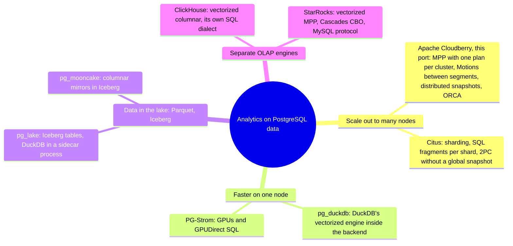
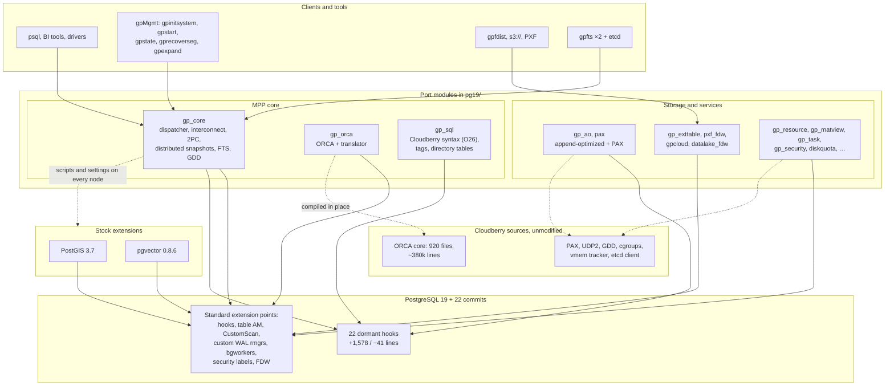
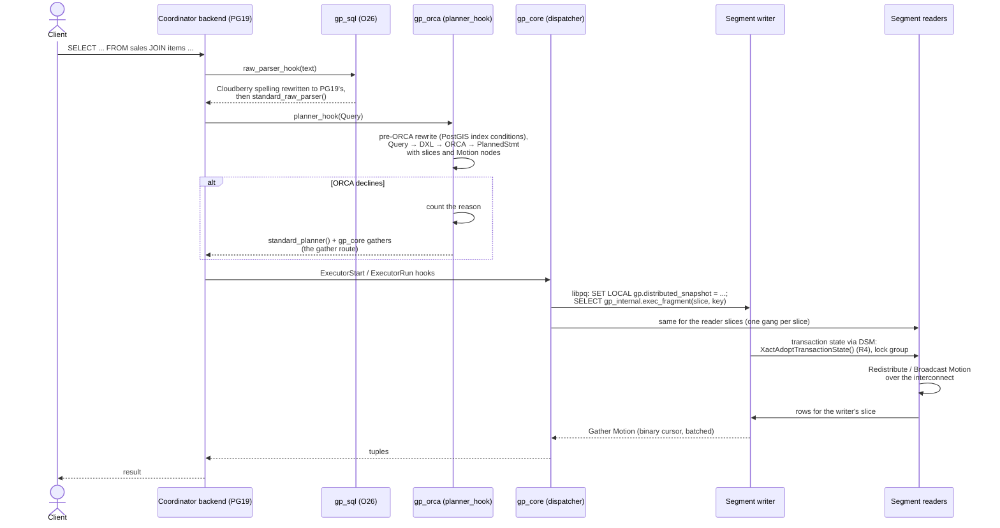
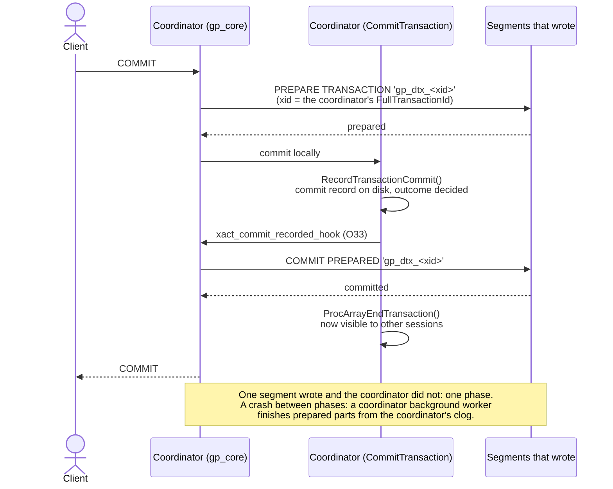
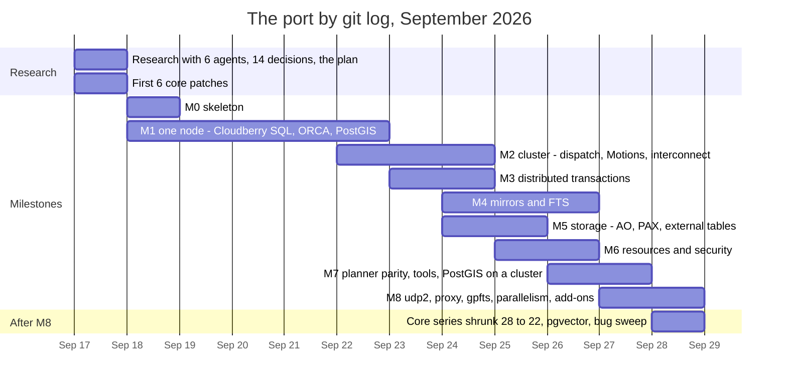

# Greenplum Without the Fork: Apache Cloudberry as PostgreSQL 19 Extensions

Greenplum has always lagged PostgreSQL by a few releases. Greenplum 6 shipped on PostgreSQL 9.4, Greenplum 7 on 12, and Apache Cloudberry 2.x on 14; Cloudberry's main branch reached 16.9 only in May 2026. The cause is structural: this MPP database is a fork. Cloudberry edits 882 PostgreSQL backend and header files (+132,680/−12,980 lines) and adds 646 more (+328,227), before counting the 1.66 million lines of the ORCA optimizer, test data included. Each new PostgreSQL major means months of merging, and by the time a merge lands, upstream has moved on.

In September 2026 I tried the opposite direction. Instead of pulling PostgreSQL into Cloudberry, I put Cloudberry on top of PostgreSQL 19 as a set of extensions. One rule was non-negotiable: a server with my core patches but without Cloudberry loaded must be indistinguishable from vanilla PostgreSQL 19, down to catalog bytes and executed instructions. Claude Code wrote the code, in dozens of sessions and agents working in parallel git worktrees. I set the goals, made the calls and checked the results.

It took 12 days and 629 commits. The result is a real Greenplum-style MPP engine, not an FDW that ships everything to a coordinator. Plans are cut into slices, rows stream between segments, and transactions use two-phase commit and distributed snapshots. All of it runs on a core changed by 22 dormant hooks.

## TL;DR

| What | Number |
|---|---|
| PostgreSQL 19 core changes | 22 commits, 47 files, +1,578/−41 lines |
| The port | one new directory, `pg19/`: 1,153 files, +432,978 lines. Zero lines changed in Cloudberry's own files |
| ORCA | 920 core files (~380k lines) compiled from Cloudberry's tree unmodified |
| Cloudberry database code ported | ≈93% by lines of code |
| Cloudberry's own tests passing | 691 of the 1,180 test files in its schedules (59%) |
| TPC-H + TPC-DS, scale factor 1 | ORCA plans all 121 queries; answers match DuckDB's; 3.1× and 4.0× faster than the non-ORCA fallback |
| Cost of the dormant hooks | −0.005% to +0.155% executed instructions |

Code: [core series](https://github.com/igor-suhorukov/postgres/tree/REL_19_STABLE_CLOUDBERRY), [port](https://github.com/igor-suhorukov/cloudberry/tree/extension_postgresql_19/pg19).

## Why an extension

Pivotal open-sourced Greenplum in 2015. After Broadcom bought VMware, the public repositories were archived in May 2024, without an announcement. The open line now lives in forks: open-gpdb (Greenplum 6), EDB's WarehousePG, and Apache Cloudberry. Cloudberry was forked by HashData from Greenplum 7 Beta 3 in 2022 and entered the Apache Incubator in October 2024. The target, PostgreSQL 19, is at Beta 4 (September 24, 2026), with a release candidate expected in early October.

How big is the thing being ported? [SonarCloud](https://sonarcloud.io/summary/overall?id=apache_cloudberry&branch=main) counts 2.6M lines of code on Apache Cloudberry's main branch (analysis of September 28, 2026, commit `3f4c688`). That is 4.0M lines with comments and blank lines, in 10,189 files:

| Language | Lines of code |
|---|---|
| C | 1,396,894 |
| SQL (SonarCloud's PL/SQL analyzer) | 731,180 |
| C++ | 337,098 |
| XML | 82,263 |
| Python | 65,961 |
| Shell | 7,310 |
| YAML | 6,670 |
| HTML, CSS, JSON, Docker, other | 1,869 |
| **Total** | **2,629,245** |

Nine-tenths of the SQL is tests: 438k lines in `src/test` and 218k in PAX's test suites. The count covers the whole repository, tests and tools included, so it is not the base of the ≈93% figure, which weighs the database code module by module.

**For Greenplum and Cloudberry users** the extension form brings:

- **A current PostgreSQL**, from MERGE and SQL/JSON to asynchronous I/O and OAuth, and PostgreSQL 19's eager aggregation and parallel autovacuum. Staying current means rebasing 22 small patches, not a months-long merge.
- **Stock extensions.** Upstream PostGIS 3.7 runs on every node instead of Cloudberry's PostGIS 3.3.2 fork, and pgvector 0.8.6 is built unpatched. The core's ABI is unchanged, so binaries built for vanilla PostgreSQL 19 load.
- **The familiar surface.** `DISTRIBUTED BY`, classic `PARTITION BY ... EVERY` clauses, external tables and gpfdist, resource groups, `gp_toolkit`, gpMgmt's tools from `gpinitsystem` to `gpexpand`, and EXPLAIN output with Motion nodes.

The price:

- migration is logical (dump and restore), not `pg_upgrade`;
- the 438 settings are renamed `gp.*`, although `gpconfig` accepts the old names;
- DDL command tags become standard;
- transparent data encryption gives way to volume encryption.

**For newcomers**, the patched server is plain PostgreSQL 19 until the modules are preloaded. Even on one node the modules add incremental materialized views, a task scheduler, append-optimized and PAX columnar storage, and ORCA. Growing into MPP does not mean changing databases: `gpinitsystem` builds the cluster and `gpexpand` adds segments online. You keep PostgreSQL's drivers, BI tools, PL/pgSQL, PostGIS and pgvector.

## Where Cloudberry fits



Cloudberry is a **PostgreSQL-compatible MPP warehouse**:

- one query is planned by a cost-based distributed optimizer and executed on all segments at once, exchanging rows between them;
- ACID transactions across the cluster;
- columnar compressed storage;
- workload management and failover.

Its home is the corporate warehouse: tens to hundreds of terabytes in star schemas, reports joining many large tables, ELT in SQL and PL/pgSQL, geodata and embeddings next to the facts.

How it compares with the PostgreSQL extensions (late September 2026):

| | Cloudberry port | Citus 14.2 | pg_duckdb 1.1.1 | pg_lake 3.5.3 | PG-Strom 6.1 |
|---|---|---|---|---|---|
| Scale | cluster of segments | cluster of shards | one node | one node + DuckDB sidecar | one GPU server |
| Execution | PostgreSQL executor; plan slices on every segment, Motions between them | PostgreSQL executor; SQL fragments per shard | vectorized DuckDB in each backend | vectorized DuckDB in `pgduck_server` | GPU code generated from SQL |
| Large joins | ORCA, cost-based distributed plans | join order "relatively naive" (its docs); repartition joins off by default | one machine | pushed to DuckDB, else PostgreSQL | inner side must fit in GPU memory |
| Consistency | 2PC + distributed snapshots | 2PC, no global snapshot | no transaction writing to both PostgreSQL and DuckDB tables | Iceberg UPDATE/DELETE serialized | PostgreSQL's |
| Core | 22 dormant patches | stock | stock | stock | stock |

pg_mooncake belongs to the same single-node lakehouse family, but Databricks bought Mooncake Labs in October 2025 and version 0.2 never shipped.

Cloudberry is the only one here that runs a complex query over large tables as a single distributed, pipelined plan, with every node reading one distributed snapshot. It also keeps PostGIS and pgvector types and UPDATE/MERGE on its columnar tables. It loses where execution speed per core matters: its executor is PostgreSQL's row-at-a-time engine. It needs a patched core, so no managed PostgreSQL service will run it, and a cluster with mirrors is heavier to operate than an extension on one node.

ClickHouse 26.9 and StarRocks 4.1.5 are separate engines with vectorized columnar execution. StarRocks brings a Cascades optimizer, a shared-data mode and lakehouse catalogs, but speaks MySQL, and its multi-statement transactions are in beta. ClickHouse has its own dialect and experimental transactions. It gained an experimental Cascades optimizer for distributed plans only in 26.8, and in 2026 it launched a managed PostgreSQL. ClickBench shows the executor gap: one flat 100M-row table, 43 queries, no joins, on a c6a.4xlarge machine. Each figure is the sum over the 43 queries of the hot run, the better of runs 2 and 3, as [ClickBench defines it](https://github.com/ClickHouse/ClickBench/blob/ad5c59b02435baff108efd7da3c9f53c422b199a/README.md?plain=1#L220-L222); every column links its published result file:

| [ClickHouse](https://github.com/ClickHouse/ClickBench/blob/ad5c59b02435baff108efd7da3c9f53c422b199a/clickhouse/results/20260928/c6a.4xlarge.json) | [DuckDB](https://github.com/ClickHouse/ClickBench/blob/ad5c59b02435baff108efd7da3c9f53c422b199a/duckdb/results/20260511/c6a.4xlarge.json) | [StarRocks](https://github.com/ClickHouse/ClickBench/blob/ad5c59b02435baff108efd7da3c9f53c422b199a/starrocks/results/20260907/c6a.4xlarge.json) | [pg_duckdb (Parquet)](https://github.com/ClickHouse/ClickBench/blob/ad5c59b02435baff108efd7da3c9f53c422b199a/pg_duckdb-parquet/results/20260511/c6a.4xlarge.json) | [Cloudberry 1.5.3 (AOCO)](https://github.com/ClickHouse/ClickBench/blob/ad5c59b02435baff108efd7da3c9f53c422b199a/cloudberry/results/20260517/c6a.4xlarge.json) | [Greenplum 7.1 (AOCO)](https://github.com/ClickHouse/ClickBench/blob/ad5c59b02435baff108efd7da3c9f53c422b199a/greenplum/results/20260517/c6a.4xlarge.json) | [Citus columnar](https://github.com/ClickHouse/ClickBench/blob/ad5c59b02435baff108efd7da3c9f53c422b199a/citus/results/20260510/c6a.4xlarge.json) | [PostgreSQL heap](https://github.com/ClickHouse/ClickBench/blob/ad5c59b02435baff108efd7da3c9f53c422b199a/postgresql/results/20260921/c6a.4xlarge.json) |
|---|---|---|---|---|---|---|---|
| 17.6 s | 26.3 s | 44.5 s | 52.5 s | 294.7 s | 768.6 s | 1,745.1 s | 11,875.4 s |

Source data: the [ClickBench repository](https://github.com/ClickHouse/ClickBench) at commit `ad5c59b` (2026-09-28); the same results are charted at [benchmark.clickhouse.com](https://benchmark.clickhouse.com/).

An order of magnitude on scans and aggregates, and the port keeps PostgreSQL's executor. ClickBench has no joins, though, and joins of large tables are where MPP engines earn their keep.

My rule of thumb:

- **Cloudberry** for complex SQL over large tables with transactions, PL/pgSQL, PostGIS and pgvector on your own hardware;
- **Citus** for multi-tenant, key-routed workloads;
- **pg_duckdb** and **pg_lake** for single-node speed and Iceberg data;
- **ClickHouse** for logs and events;
- **StarRocks** for joins plus lakehouse elasticity.

## The ground rules

The project started with two sentences to Claude Code: "research cloudberry project directory and explore how to use hooks and macros to move it with minimal code changes to PostgreSQL v19", and "Plan the approach so that modifications to the PostgreSQL core—made without the Greenplum extension loaded—do not alter the operation or functionality of the PostgreSQL server." Seven rules followed, and none was relaxed:

1. **Existing extension points first:** hooks, table access methods, CustomScan, custom WAL resource managers, background workers, security labels, FDWs.
2. **Where they are not enough, add a minimal custom hook to the core.** A custom hook here is a function pointer that is NULL by default, a new exported function, a registration list or an off-by-default flag. No existing signature changes, no struct gains a field, and no catalog, WAL, page or protocol format changes.
3. **Without the extension, the server is vanilla, and this is measured.** With Cloudberry's objects present but its library missing, the server fails cleanly: an error at table open or a FATAL at WAL replay.
4. **Cloudberry's code is not edited in place.** The whole port is one new directory, `pg19/`, and Cloudberry's files compile where they lie, so upstream merges keep applying. A file that must change becomes a copy that says what changed.
5. **New PostgreSQL features are used, not worked around.**
6. **ORCA sits behind `planner_hook`, with query rewriting in front of it**, instead of patches inside the optimizer.
7. **Third-party extensions stay stock.**

"Vanilla" is checked by comparing two Docker images built from the same PostgreSQL commit, one with the series and one without:

- PostgreSQL's own `meson test`: the same 371 tests pass;
- `abidiff`: 32 symbols added, 0 changed;
- catalogs, settings, keywords and stored parse trees: byte-identical;
- query IDs: identical;
- data directories and streaming replication: interchangeable in both directions;
- cachegrind: from −0.005% to +0.155% instructions, against a 0.5% failure line ([the check](https://github.com/igor-suhorukov/cloudberry/blob/16b1ef30668f13423f44762eaeca3a252dc52319/pg19/test/vanilla/checks/09-performance.sh));
- a script checks that every statement added inside an existing function sits behind a hook, registry or flag, with one reviewed exception on record;
- a probe module sets every hook and asserts its effects.

The checks paid off early. The first test of a combo-CID hook crashed the server, which showed that the hook is load-bearing, not decorative.

## Where the existing hooks fall short: 22 custom hooks

Greenplum could run on a completely unmodified PostgreSQL only as a different product: segments would receive SQL instead of plans, each with its own OIDs and snapshot, as in Citus. The MPP executor needs the cluster to share one plan and one transaction. PostgreSQL 19 has no extension point for that, and the core series fills the gap:

| Need | Patches | Why no existing hook works |
|---|---|---|
| Identical OIDs on every node | R1 `new_oid_hook` | OID allocation has no hook |
| All slices at once, readers seeing the writer's uncommitted rows | R2 combo-CID hooks, R4 `XactAdoptTransactionState()` | only PostgreSQL's parallel workers share a transaction |
| 2PC in Cloudberry's order; table locks without upgrade deadlocks | O33, O30 | `XACT_EVENT_COMMIT` fires after visibility; the parser picks lock modes first |
| Cloudberry's syntax, `gp_segment_id`, `SELECT *` hiding matview counters | O26, O10, O31, O28 | no parser hook; system columns change catalogs |
| Distributed ANALYZE, incremental matviews | O3, O27 | heap sampling hard-wired; maintenance mode is static |
| Append-optimized and PAX storage, diskquota, checksums | O13–O18, O21, O23 | `TableAmRoutine` cannot grow without breaking the ABI; the storage manager has no hooks |
| Tablespaces per node, memory protection, fault tests | O32, O25, O29 | fixed paths in redo; memory-context methods are `static const` |

The series began as 28 commits. It shrank to 22 when five patches moved into the modules: the sync-replication cancel, EXPLAIN node labels, the size functions, UPDATE's old row and the unlink hook. That cost PAX 70% on full-table UPDATEs and made append-optimized UPDATEs 10–25% faster. Four of the custom hooks are general enough to propose upstream: the table AM registry, smgr file events, the parser hook and the OID hook.

No custom hook can carry changes to formats or the protocol:

- private libpq messages;
- 20 shared catalogs;
- 81 keywords;
- 217 fixed OIDs;
- cluster-wide TDE. Without the key, roughly one encrypted page in a hundred would pass PostgreSQL's header check and be read as garbage.

Metadata moved to security labels and extension tables, and TDE became volume encryption.

## Architecture

From the outside, it is Greenplum: a coordinator holding the catalog and planning queries, and segments, each a full PostgreSQL 19 instance with its share of the rows and a mirror on another host. Only the wiring is new.





**Parsing without a forked grammar.** `gp_sql` tokenizes each statement with PostgreSQL's own scanner and replaces Cloudberry's spelling with the standard one. Clauses become options that `ProcessUtility_hook` strips before PostgreSQL would reject them:

```sql
CREATE TABLE sales (id bigint, dt date)
DISTRIBUTED BY (id)
PARTITION BY RANGE (dt)
  (START (date '2026-01-01') END (date '2027-01-01')
   EVERY (interval '1 month'));

-- reaches PostgreSQL 19's grammar as (simplified):
CREATE TABLE sales (id bigint, dt date)
PARTITION BY RANGE (dt)
WITH (gp.distributed_by = '(id)',
      gp.partition_by = $gp$PARTITION BY RANGE (dt) (START ...)$gp$);
```

One statement stays one statement. An early version that emitted two broke every driver that prepares statements. Error carets point at the user's text. The rewriter is 9,793 lines, against a 20,077-line `gram.y` that a fork would have to rebase every year.

**ORCA, untouched.** ORCA's four core libraries include no PostgreSQL header, so its 920 files compile from Cloudberry's tree unmodified, with zero warnings, in 17 seconds. The coupling is the port's Query ↔ DXL ↔ plan translator (27 files, ~33k lines) and a wrapper layer. Of the wrapper layer's 198 functions, 170 needed only includes; real API drift from PostgreSQL 16 turned up in six places. What ORCA cannot digest is rewritten first. For example, it refuses every PostGIS spatial predicate. Instead of copying PostGIS's GPL table of index conditions, `gp_orca` asks PostGIS's support function what it would tell the planner, and adds the `&&` condition it gets back. That took 482 lines for 21 signatures. When ORCA still declines, the reason is counted and the query takes the "gather route": PostgreSQL's planner over gathers of each distributed table.

**Dispatch and execution.** Cloudberry's private protocol messages would end a PostgreSQL 19 session. So the dispatcher is an ordinary libpq client, using SCRAM or TLS, that sends each slice inside `SELECT gp_internal.exec_fragment(...)`, and the segment's `planner_hook` swaps the fragment in. The distributed snapshot arrives as a `SET LOCAL`. On each segment a writer runs one slice and readers run the rest, adopting the writer's transaction through R4, joining its lock group and resolving combo command IDs through R2. The rest is PostgreSQL's own parallel-worker machinery. Motions stream rows over TCP, over Cloudberry's UDP with flow control, over UDP2, or through a proxy that multiplexes all Motions between two nodes.



**Transactions without a snapshot patch.** Distributed snapshots looked impossible without core patches until the angle changed: make each segment's snapshot agree with the coordinator's, not the reverse. A segment waits for a transaction the distributed snapshot says committed but that it holds only as prepared. It hides one it has committed locally that is still running globally. A replication slot keeps VACUUM away from rows such transactions deleted. The coordinator's own commit record decides every outcome, and a single writing segment commits in one phase: single-row INSERTs went from 371 to 950 transactions per second. Cloudberry's global deadlock detector runs as it is in a background worker.

**Storage and failover.** Append-optimized tables are table access methods whose blocks are ordinary 8K pages logged by a custom WAL resource manager, so standbys, base backups and `pg_checksums` see normal pages. PAX's C++ compiles in place, 65 of its 91 files unchanged. External tables are an FDW. Directory tables are now WAL-logged, which Cloudberry's are not. FTS is a background worker that probes segments over SQL and promotes mirrors with `pg_promote()`. `gpfts` instances elect a leader through etcd to fail over the coordinator.

## The components

| Module | Role | Plugs in via |
|---|---|---|
| `gp_core` | cluster file, dispatcher and gangs, Motions, interconnect, DDL on every node, 2PC, distributed snapshots, deadlock detector, FTS, `gp_toolkit` | executor, utility and planner hooks; background workers; custom WAL rmgr; security labels; CustomScan; R1, R2, R4, O3, O10, O29–O33 |
| `gp_orca` | ORCA, translator, fallback counters, pre-ORCA rewrites | `planner_hook`, CustomScan, EXPLAIN hooks |
| `gp_sql` | Cloudberry syntax, tags, directory tables, extension scripts on every node | O26, `ProcessUtility_hook`, a WAL rmgr |
| `gp_ao`, `pax` | append-optimized row and column tables, PAX, bitmap index | table AM, O13–O18, O21, O23, WAL rmgrs |
| `gp_exttable`, `pxf_fdw`, `gpcloud`, `datalake_fdw` | external data: file, gpfdist, http, s3, PXF, Iceberg | FDW, table AM |
| `gp_resource`, `gp_security`, `gp_matview`, `gp_task`, `diskquota` | resource groups on cgroups, memory protection, profiles, incremental matviews, scheduler, quotas | labels, O25, O27, O28, O21, background workers |
| `gpfts`, gpMgmt | coordinator failover; Cloudberry's management tools | programs over SQL and PostgreSQL 19's own `initdb`, `pg_ctl`, `pg_basebackup`, `pg_rewind` |

What the administrator sees:

- `gp_core` loads first, and preload-only modules refuse `LOAD`, so a server never runs half-initialized.
- There are no shared catalogs. Role attributes live in shared security labels, secrets live in a maintenance database, and topology lives in a cluster file. `gp_segment_configuration` and its relatives are views.

## Limitations

- **PostgreSQL 19 as a platform:**
  - extension settings must be dotted, hence `gp.*`;
  - command tags are a fixed list;
  - `CHECK_FOR_INTERRUPTS()` takes no callbacks, so a running query moves to another resource group only while it waits;
  - a cursor fetched in batches never runs in parallel.
- **The port against Cloudberry:**
  - Cloudberry's MPP variant of the PostgreSQL planner, "Route B", is not ported, so what ORCA declines takes the slower gather route;
  - ORCA's planning costs more on short queries: 13.7 ms against 0.25 ms for a one-row point lookup, as [measured by the pgorca project](https://github.com/quantumiodb/pgorca/blob/63e4e96c2454cdfd154b0b78d5dfcf19de70a775/TODO.md?plain=1#L68-L75);
  - parallelism inside a segment covers only the writer's slice;
  - SERIALIZABLE on a cluster is REPEATABLE READ, as in Greenplum.
- **MPP itself:**
  - the coordinator is the single planner and entry point;
  - joins off the distribution key move data over the network;
  - unique constraints must include the key;
  - adding nodes means redistributing data.

## How it was built: M0–M8

On September 17, six research agents each studied one area of the codebase and wrote a report. A script verified all 1,440 of their `file:lines` citations, and 14 design decisions were taken the same day. The plan became a journal of 16,460 lines, where `Built <date>` is reserved for code that was written, run and tested, and a corrections section records where reality disagreed. One entry reads "a test that passes may check nothing": an interconnect test had passed since M2 while a bare `except` swallowed its failures.

Agents decided implementation questions themselves and wrote down why. Anything touching the PostgreSQL core, a shared branch or a deletion came to me. Large milestones were split between agents, each with its own branch and worktree: nine agents built M8, and seven swept bugs and skipped tests.



| Milestone | Dates | Result |
|---|---|---|
| M0 skeleton | Sept 18 | all modules build and load; vanilla checks pass |
| M1 one node | Sept 18–22 | Cloudberry SQL, ORCA, PostGIS; PostgreSQL's 239 regression tests line for line |
| M2 cluster | Sept 22–24 | dispatcher, Motions, streaming interconnect |
| M3 transactions | Sept 23–24 | 2PC, distributed snapshots, deadlock detector |
| M4–M6 | Sept 24–26 | mirrors and FTS; AO, PAX, external tables; resource groups |
| M7 parity and tools | Sept 26–27 | gpMgmt on PostgreSQL 19's tools, PostGIS on a cluster, TPC measured |
| M8 | Sept 27–28 | UDP2, proxy, gpfts, gpexpand, four add-on extensions |

Commits per day ran 10, 9, 15, 26, 31, 29, 87, 51, 87, 186 and 98. The first days went to ORCA and its translator, where understanding mattered more than speed. From September 24, with the cluster and a parallel test runner in place, milestones overlapped.

Some surprises along the way:

- **Zero segments.** Single-node mode first reported zero segments. A debug ORCA silently fell back on every query. A release build divided by zero and clamped infinity to 1e+250, producing plausible plans by accident.
- **Bit 0x0400.** Cloudberry gates ORCA on cursor flag 0x0400, which in PostgreSQL 19 means `CURSOR_OPT_CUSTOM_PLAN`. A literal port would compile cleanly and turn ORCA off for every custom plan.
- **Lock upgrades.** Taking Cloudberry's table lock after the parser's weaker one made 87% of concurrent UPDATEs fail in pgbench. That is why O30 exists.
- **The desktop.** Forty-three parallel test jobs exhausted 60 GB of RAM, and the OOM killer took the desktop session with them. The runner now starts a job only if its declared memory fits.

## Non-functional requirements and ORCA on TPC

The measured requirements were vanilla behaviour, hook overhead, ABI stability, reproducible builds and correct answers. Every figure comes from Docker images built from committed branches. A full run of the port's test suites is 58–64 jobs and finishes in 500–900 seconds.

The deciding measurement concerned Route B. My instruction was to fix the port's own ORCA fallbacks first, then measure a real workload before deciding. The setup:

- TPC-H's 22 and TPC-DS's 99 queries as DuckDB ships them;
- data at scale factor 1;
- one coordinator and four segments in one container on a 16-core, 60 GB host;
- no assertions, data in tmpfs, JIT and parallel query off;
- DuckDB's answers as the reference, compared to the cent.

| | TPC-H | TPC-DS |
|---|---|---|
| Planned by ORCA | 22/22 | 99/99 |
| Answers equal to DuckDB's | all | all |
| ORCA vs gather route, geometric mean | 3.1× (4.4 s vs 123 s, 20 queries) | 4.0× (25 s vs 386 s, 96 queries) |
| Not finished in 120 s on the gather route | q17, q20 | 04, 14, 64 |

Source data:

- **The benchmark harness**, [`pg19/test/tpc`](https://github.com/igor-suhorukov/cloudberry/tree/16b1ef30668f13423f44762eaeca3a252dc52319/pg19/test/tpc) in the port: it generates the data, loads the cluster, runs every query under ORCA and on the gather route, and compares the rows.
- **Queries and reference answers** come from DuckDB 1.5.5's own kits: TPC-H [queries](https://github.com/duckdb/duckdb/tree/v1.5.5/extension/tpch/dbgen/queries) and [SF1 answers](https://github.com/duckdb/duckdb/tree/v1.5.5/extension/tpch/dbgen/answers/sf1), TPC-DS [queries](https://github.com/duckdb/duckdb/tree/v1.5.5/extension/tpcds/dsdgen/queries) and [SF1 answers](https://github.com/duckdb/duckdb/tree/v1.5.5/extension/tpcds/dsdgen/answers/sf1).
- **The recorded run of the harness** is in the message of commit [`beaf7379d12`](https://github.com/igor-suhorukov/cloudberry/commit/beaf7379d12abeab98eebe1750e441182f26dda2): 121 of 121, 3.13× and 3.94×, and the same five queries unfinished.

The table's totals come from the first, three-round measurement in the project journal. Its per-query timings are not published yet.

Under ORCA those five take 0.2–1.6 s, and all 121 queries run in 34 s. On six short queries (0.1–0.75 s) ORCA is more than a fifth slower. On Cloudberry's regression suite, the port's own fallback reasons fell from 563 to 52; what remains is ORCA's inherited list, led by non-default collations. So the recommendation is to keep shrinking ORCA's declines instead of porting Route B's 30–45k lines. The decision is still open.

## Conclusion

Twelve days ago it was an open question whether Greenplum could become an extension of a modern PostgreSQL without turning into a different product. Now there is code to point at:

- a core changed by 22 dormant hooks, provably vanilla without them;
- Cloudberry's tree untouched and ORCA unmodified;
- stock PostGIS and pgvector on the segments, each segment's vector index answering its own share of a nearest-neighbour search;
- over 90% of Cloudberry's database code ported: ≈93%, or ≈97% without Route B, leaving ORCA's untouched 380k lines out of both sides.

Only 691 of Cloudberry's 1,180 test files run so far, and that sets the goal. The extension should pass Apache Cloudberry's original test suites with minimal changes to the tests themselves. Every skipped test is listed with the statement that stops it, and every output difference is reviewed and recorded, so the count can only fall. Next come:

- the rest of `isolation2` and `greenplum_schedule`;
- the Route B decision, behind a proposed `gp.mpp_planner` switch for side-by-side comparison;

As for the process, it worked not because an AI types faster, but because it ran like a good engineering team. Research came with verifiable citations, invariants were checked by machines, "done" meant "run and tested", agents worked in isolated worktrees, and a human signed off every change to the core. The Greenplum fork took years to move from PostgreSQL 9.4 to 12. The extension's next major-version move is 22 small patches and a compatibility layer.

Project result: [core series](https://github.com/igor-suhorukov/postgres/tree/REL_19_STABLE_CLOUDBERRY), [port](https://github.com/igor-suhorukov/cloudberry/tree/extension_postgresql_19/pg19).
