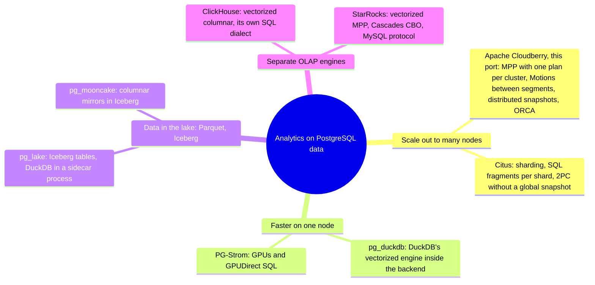
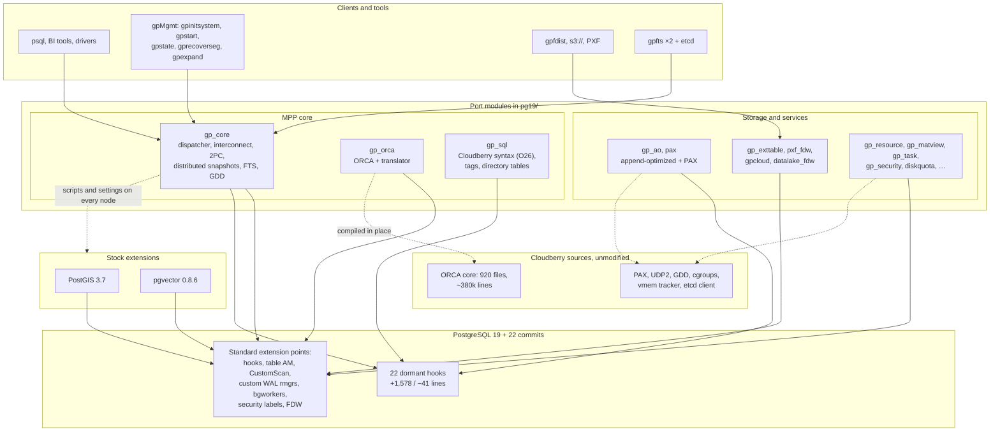
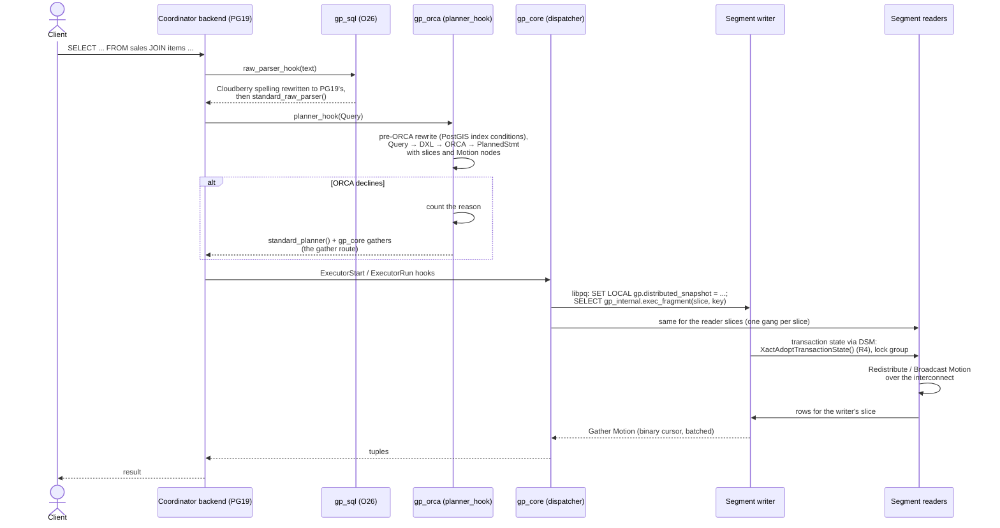
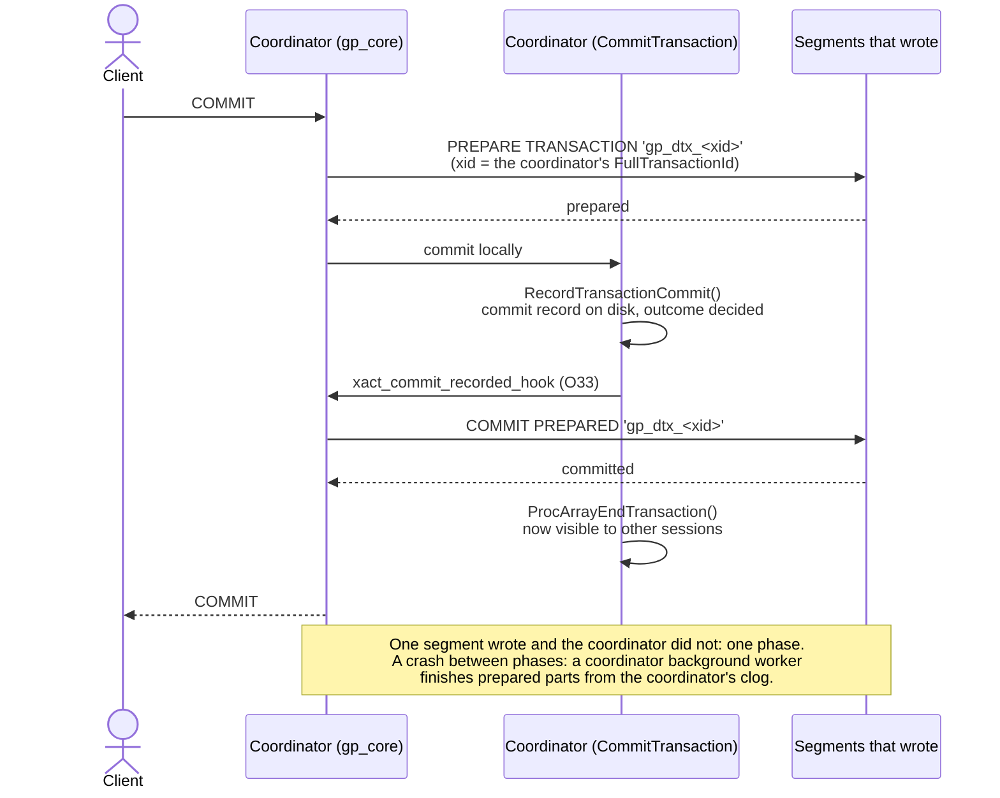
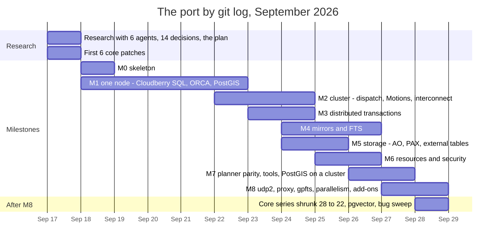

# Greenplum Without the Fork: Apache Cloudberry as PostgreSQL 19 Extensions

> This is my personal experiment, not an official Apache Cloudberry release.

Since 2017 I have been keeping an eye on the PostgreSQL ecosystem for analytics and data warehousing. At work I had used AWS Redshift, with all the drawbacks and inconveniences a developer gets from a fork of an old PostgreSQL. To my mind, the ideal PostgreSQL-based solution should run on the latest PostgreSQL release, be built as an extension, be easy to start locally in a container for tests, and work with the latest versions of existing extensions such as PostGIS and pgvector.

Citus came closest to what I wanted, but I wouldn't call it a full-fledged massively parallel processing (MPP) system. It is more about sharding data for OLTP workloads.

Greenplum, an MPP fork of PostgreSQL, has a lot going for it, and plenty of people run it for real work, but the PostgreSQL it is built on lags behind the current one. So I set out to turn Apache Cloudberry, the most up-to-date open-source version of Greenplum, into a set of extensions for PostgreSQL 19. For now this is my personal experiment, not an official Apache Cloudberry release. With an LLM's help, more than 90% of Cloudberry's database code has been ported, and 59% of the original project's tests now run on the new version. It took me 12 days...

Greenplum has always trailed PostgreSQL by a few releases. Greenplum 6 shipped on PostgreSQL 9.4 and Greenplum 7 on 12, and Apache Cloudberry, which carries the Greenplum project on, got its main branch up to 16.9 only in May 2026. The reason is that this massively parallel database is a fork: Cloudberry has changed 882 of PostgreSQL's source files and added 646 new ones, not counting the 1.66 million lines of its ORCA optimizer, test data included. Every new PostgreSQL major version means months of merging, and by the time the developers finish, upstream has moved on.

I decided to go the other way around and cross a hedgehog with a snake, there is a saying: instead of pouring PostgreSQL's sources into Greenplum, fit Cloudberry on top of PostgreSQL 19 as a set of extensions. The most important principle was that PostgreSQL 19 may get a few small changes for new extension points, but a server with my core patches and without Cloudberry's extensions loaded must be indistinguishable from vanilla PostgreSQL 19, both to its users and to other extensions, and must perform almost exactly like the unmodified core, within a fraction of a percent.

Claude Code wrote the code for me, in many sessions, with agents working in parallel git worktrees. I discussed the initial plan with the LLM, made the architectural decisions and checked the results. The last time I wrote serious C/C++ was almost 20 years ago, and yet I consider this experiment a success!

All told, it took 12 days and 629 commits to get an MPP engine that works like the Greenplum fork, not just another FDW that drags all the data to the coordinator. Plans are cut into slices, rows travel between segments while a query runs, and transactions use distributed snapshots and two-phase commit. PostgreSQL itself needed only 22 small patches that add new extension points. (I confess there were 28 at first; I brought the number down later, at the cost of a few compromises.)

## TL;DR

| What | Number |
|---|---|
| PostgreSQL 19 core changes | 22 commits, 47 files, +1,578/−41 lines |
| The port | one new directory, `pg19/`: 1,153 files, +432,978 lines. Zero lines changed in Cloudberry's own files |
| ORCA | 920 core files (~380k lines) compiled from Cloudberry's tree unmodified |
| Cloudberry database code ported | ≈93% by lines of code |
| Cloudberry's own tests passing | 691 of the 1,180 test files in its schedules (59%) |
| TPC-H + TPC-DS, scale factor 1 | ORCA plans all 121 queries; answers match DuckDB's; 3.1× and 4.0× faster than the non-ORCA fallback |
| Cost of the dormant hooks | −0.005% to +0.155% executed instructions |

Code: [core series](https://github.com/igor-suhorukov/postgres/tree/REL_19_STABLE_CLOUDBERRY), [port](https://github.com/igor-suhorukov/cloudberry/tree/extension_postgresql_19/pg19), [build instructions](https://github.com/igor-suhorukov/cloudberry/tree/extension_postgresql_19/pg19#building).

## Why an extension

Pivotal open-sourced Greenplum more than a decade ago, in 2015, but some time after Broadcom bought VMware, the project's repositories were archived. The same code now lives on in forks: open-gpdb, EDB's WarehousePG and Apache Cloudberry. Cloudberry is based on Greenplum 7 and entered the Apache Incubator. PostgreSQL 19 isn't stable yet: it is at Beta 4, with a release candidate expected any week now.

How big is the thing being ported? [SonarCloud](https://sonarcloud.io/summary/overall?id=apache_cloudberry&branch=main) counts 2.6M lines of code on Apache Cloudberry's main branch (analysis of September 28, 2026, commit `3f4c688`). That is 4.0M lines with comments and blank lines, in 10,189 files:

| Language | Lines of code |
|---|---|
| C | 1,396,894 |
| SQL (SonarCloud's PL/SQL analyzer) | 731,180 |
| C++ | 337,098 |
| XML | 82,263 |
| Python | 65,961 |
| Shell | 7,310 |
| YAML | 6,670 |
| HTML, CSS, JSON, Docker, other | 1,869 |
| **Total** | **2,629,245** |

Nine-tenths of the SQL is tests: 438k lines in `src/test` and 218k in PAX's test suites. The count covers the whole repository, tests and tools included, so it is not the base of the ≈93% figure, which weighs the database code module by module.

The main advantage of an extension is that you get the latest PostgreSQL and almost every tool in its ecosystem unmodified, as ready-built packages. Moving to the next major version is also far less painful than it is for a fork: rebasing means carrying 22 small patches, about 1,600 lines in total, over to the new release, not months of merging.

For current Greenplum and Cloudberry users, the extension brings:

- A current PostgreSQL, from MERGE and the latest SQL/JSON goodies to asynchronous I/O and parallel autovacuum.
- Community extensions. The nodes can run upstream PostGIS 3.7 instead of Cloudberry's fork of PostGIS 3.3.2, and pgvector 0.8.6 runs unpatched. Binary modules built for vanilla PostgreSQL 19 load as they are, because the core's ABI hasn't changed.
- The familiar bits: `DISTRIBUTED BY` and the classic `PARTITION BY ... EVERY`, gpfdist, `gp_toolkit`, gpMgmt's tools from `gpinitsystem` to `gpexpand`, and EXPLAIN output with Motion nodes.

There is no free lunch, of course. You pay with a logical migration (dump and restore) instead of `pg_upgrade`. The 438 configuration settings are renamed with a `gp.` prefix, although `gpconfig` still accepts the old names. Much of Cloudberry's DDL is translated under the hood into standard PostgreSQL statements, and that is what command tags and dumps show. And database-level encryption gives way, for now, to volume encryption in the operating system.

For newcomers to Greenplum, the extension means:

- The patched PostgreSQL looks like any ordinary PostgreSQL as long as Cloudberry isn't loaded into it.
- Even on a single node, loading the modules gives you incremental materialized views, a task scheduler, append-optimized tables and PAX columnar storage, and, most useful of all, the ORCA optimizer.
- Going MPP on a cluster doesn't mean trading the PostgreSQL you know for another ecosystem, other drivers or other BI tools.
- Your PL/pgSQL, PostGIS and pgvector stay with you.

## Cloudberry as a PostgreSQL-compatible MPP warehouse

A cost-based distributed optimizer plans each query. The plan itself, serialized, is shipped to the nodes and runs on all segments at once, and the segments pass the data they need to each other through Motions. Through all of this, transactions stay ACID across the whole cluster, and compressed columnar storage is there when you want it. On top of it all sit workload management and failover.

The typical use is a data warehouse of tens or hundreds of terabytes in star and snowflake schemas, with reports that join many large tables. It is also often used to run ELT in SQL and PL/pgSQL.



Here is how it compares with PostgreSQL extensions as of September 2026:

| | My Cloudberry port | Citus 14.2 | pg_duckdb 1.1.1 | pg_lake 3.5.3 | PG-Strom 6.1 |
|---|---|---|---|---|---|
| Scale | cluster of segments | cluster of shards | one node | one node + DuckDB in a sidecar process | one GPU server |
| Execution | PostgreSQL executor; plan slices on every segment, Motions between them | PostgreSQL executor; SQL fragments per shard | vectorized DuckDB in each backend | vectorized DuckDB in `pgduck_server` | GPU code generated from SQL |
| Large joins | ORCA, cost-based distributed plans | join order "relatively naive" (its docs); repartition joins off by default | one machine | pushed to DuckDB, otherwise run by PostgreSQL | inner side must fit in GPU memory |
| Consistency | 2PC + distributed snapshots | 2PC, no global snapshot | no transaction writing to both PostgreSQL and DuckDB tables | Iceberg UPDATE/DELETE run one at a time | PostgreSQL's |
| Core | 22 core patches | stock | stock | stock | stock |

pg_mooncake belongs to the same single-node lakehouse family, but Databricks bought Mooncake Labs in October 2025 and version 0.2 never shipped.

Of all of these, only my Cloudberry port runs a complex query over large tables as a single distributed, pipelined plan in which every node reads the same distributed snapshot. It also lets you keep PostGIS, pgvector and other types in its columnar tables and run UPDATE and MERGE on them. Where it loses, for now, is speed per CPU core: PostgreSQL's executor is an engine built around rows in memory. And in its current form the extension is unlikely to make it into managed PostgreSQL services: it needs a patched core, and the likes of AWS and Azure won't go for that.

Among the popular open-source engines for analytical queries, ClickHouse 26.9 and StarRocks 4.1.5 are entirely different beasts, with vectorized columnar executors. StarRocks has its own Cascades optimizer and lakehouse catalogs, while its multi-statement transactions are still in beta. ClickHouse has its own SQL dialect and experimental transactions.

ClickBench shows the gap between the executors: one flat table of 100 million rows, 43 queries, no joins, on a c6a.4xlarge machine. Each figure is the total over all 43 queries of the hot run, meaning the better of runs 2 and 3, [as ClickBench defines it](https://github.com/ClickHouse/ClickBench/blob/ad5c59b02435baff108efd7da3c9f53c422b199a/README.md?plain=1#L220-L222); each column header links to its published result file:

| [ClickHouse](https://github.com/ClickHouse/ClickBench/blob/ad5c59b02435baff108efd7da3c9f53c422b199a/clickhouse/results/20260928/c6a.4xlarge.json) | [DuckDB](https://github.com/ClickHouse/ClickBench/blob/ad5c59b02435baff108efd7da3c9f53c422b199a/duckdb/results/20260511/c6a.4xlarge.json) | [StarRocks](https://github.com/ClickHouse/ClickBench/blob/ad5c59b02435baff108efd7da3c9f53c422b199a/starrocks/results/20260907/c6a.4xlarge.json) | [pg_duckdb (Parquet)](https://github.com/ClickHouse/ClickBench/blob/ad5c59b02435baff108efd7da3c9f53c422b199a/pg_duckdb-parquet/results/20260511/c6a.4xlarge.json) | [Cloudberry 1.5.3 (AOCO)](https://github.com/ClickHouse/ClickBench/blob/ad5c59b02435baff108efd7da3c9f53c422b199a/cloudberry/results/20260517/c6a.4xlarge.json) | [Greenplum 7.1 (AOCO)](https://github.com/ClickHouse/ClickBench/blob/ad5c59b02435baff108efd7da3c9f53c422b199a/greenplum/results/20260517/c6a.4xlarge.json) | [Citus columnar](https://github.com/ClickHouse/ClickBench/blob/ad5c59b02435baff108efd7da3c9f53c422b199a/citus/results/20260510/c6a.4xlarge.json) | [PostgreSQL heap](https://github.com/ClickHouse/ClickBench/blob/ad5c59b02435baff108efd7da3c9f53c422b199a/postgresql/results/20260921/c6a.4xlarge.json) |
|---|---|---|---|---|---|---|---|
| 17.6 s | 26.3 s | 44.5 s | 52.5 s | 294.7 s | 768.6 s | 1,745.1 s | 11,875.4 s |

Source data: the [ClickBench repository](https://github.com/ClickHouse/ClickBench) at commit `ad5c59b` (2026-09-28); the same results are charted at [benchmark.clickhouse.com](https://benchmark.clickhouse.com/).

On scans and aggregates the vectorized engines are an order of magnitude ahead, because Cloudberry's executor processes rows in memory without vectorization, and so does my port's, which is simply PostgreSQL's. But this benchmark has no joins of many large tables, and that is exactly where MPP engines justify their architecture and optimizations.

So my rule of thumb is:

- Cloudberry for complex SQL over large tables with transactions, PL/pgSQL, PostGIS and pgvector, on your own servers;
- Citus for multi-tenant workloads routed by key;
- pg_duckdb and pg_lake for single-node speed and data in Iceberg;
- ClickHouse for logs and events, where it shines;
- StarRocks for joins combined with lakehouse elasticity.

## The ground rules

It all started with a plan. My two prompts to Claude Opus 5 were "research cloudberry project directory and explore how to use hooks and macros to move it with minimal code changes to PostgreSQL v19" and "Plan the approach so that modifications to the PostgreSQL core—made without the Greenplum extension loaded—do not alter the operation or functionality of the PostgreSQL server." The result was six rules that the coding agents followed strictly:

1. Use PostgreSQL's existing extension points first: hooks, table access methods, CustomScan, custom WAL resource managers, background workers, security labels, FDWs.
2. Where they aren't enough, add a minimal hook of your own. Here, a hook of your own means a function pointer that is NULL by default, an exported function, a registration list or a flag that is off by default. No existing signature changes, no existing struct gains a field, and the catalog, WAL, page and protocol formats stay as they are.
3. Without the extension loaded, the server behaves like vanilla PostgreSQL.
4. Cloudberry's existing code isn't edited. The whole port is one new directory, `pg19/`, and the upstream project's files are left alone, which keeps merges simple. If a file does have to change, a copy of it goes into the extension's directory with a note on what was modified.
5. ORCA sits behind `planner_hook`. What it can't handle is rewritten in the query before it gets there; the optimizer itself is not patched.
6. Third-party extensions stay as upstream ships them, unedited. Where an adaptation is needed, it lives in `pg19/`, as it did for a couple of PostGIS features.

Vanilla behaviour is checked by tests that compare two Docker images built from the same PostgreSQL commit, one with the patch series and one without:

- PostgreSQL's own `meson test`: the same 371 tests pass;
- `abidiff`: 32 symbols added, 0 changed;
- catalogs, settings, keywords and stored parse trees: byte-identical;
- query IDs: identical;
- data directories and streaming replication: interchangeable in both directions;
- cachegrind: from −0.005% to +0.155% instructions, against a 0.5% failure threshold ([the check](https://github.com/igor-suhorukov/cloudberry/blob/16b1ef30668f13423f44762eaeca3a252dc52319/pg19/test/vanilla/checks/09-performance.sh));
- a script checks that every statement added inside an existing function sits behind a hook, a registry or a flag; there is one documented exception;
- a probe module installs every hook and checks what it does.

The checks were worth it: the very first test of the new combo-CID hook crashed the server.

### Where the existing hooks fell short: 22 new ones

On a completely unmodified core, Greenplum could only work as a different product: segments would receive SQL text instead of ready-made plans, and each would have its own OIDs and snapshots, the way Citus does it. An MPP executor needs the whole cluster to share one plan and one transaction. PostgreSQL 19 has no extension points for that, so I had to cobble together new core patches:

| Need | Patches | Why no existing hook works |
|---|---|---|
| Identical OIDs on every node | R1 `new_oid_hook` | OID allocation has no hook |
| All slices at once, readers seeing the writer's uncommitted rows | R2 combo-CID hooks, R4 `XactAdoptTransactionState()` | only PostgreSQL's own parallel workers share a transaction |
| 2PC in Cloudberry's order; table locks without upgrade deadlocks | O33, O30 | `XACT_EVENT_COMMIT` fires once the transaction is already visible; the parser picks lock modes first |
| Cloudberry's syntax, `gp_segment_id`, `SELECT *` hiding matview counters | O26, O10, O31, O28 | there is no parser hook; system columns change catalogs |
| Distributed ANALYZE, incremental matviews | O3, O27 | heap sampling is hard-wired; maintenance mode is static |
| Append-optimized and PAX storage, diskquota, checksums | O13–O18, O21, O23 | `TableAmRoutine` cannot grow without breaking the ABI; the storage manager has no hooks |
| Tablespaces per node, memory protection, fault tests | O32, O25, O29 | redo has fixed paths built in; memory-context methods are `static const` |

At first the core got 28 new commits. Later, after a careful look at what could be removed or replaced, five patches moved into the modules (the query cancel while waiting for synchronous replication, node labels in EXPLAIN, the size functions, UPDATE's old row version and the unlink hook), and two more were merged into one. The main compromise: full-table UPDATEs on PAX got 70% slower, though UPDATEs on append-optimized tables got 10–25% faster.

Four of the new hooks are general enough to propose upstream: the table AM registry, smgr file events, the parser hook and the OID hook.

Changes to formats and the protocol, however, can't be carried by any custom hook:

- private libpq messages;
- 20 shared catalogs;
- 81 keywords;
- 217 fixed OIDs;
- cluster-wide TDE.

Greenplum's metadata moved into PostgreSQL's security labels and extension tables, and instead of TDE I decided that, for now, it is better to encrypt the volume at the operating-system level. With somewhat deeper core changes, though, TDE could be made to work exactly as it does in Cloudberry.

## Architecture

From the outside it is Greenplum: a coordinator that holds the catalog and plans queries, and segments on other hosts, each a full PostgreSQL 19 instance with its own share of the rows. The only new thing is how it is all wired together.





SQL parsing works without a forked grammar (Cloudberry forks it). The `gp_sql` module splits each statement into tokens with PostgreSQL's own scanner and replaces Greenplum's syntax with the standard one. Its `ProcessUtility_hook` then picks up the options that PostgreSQL would otherwise reject with an error:

```sql
CREATE TABLE sales (id bigint, dt date)
DISTRIBUTED BY (id)
PARTITION BY RANGE (dt)
  (START (date '2026-01-01') END (date '2027-01-01')
   EVERY (interval '1 month'));

-- reaches PostgreSQL 19's grammar as (simplified):
CREATE TABLE sales (id bigint, dt date)
PARTITION BY RANGE (dt)
WITH (gp.distributed_by = '(id)',
      gp.partition_by = $gp$PARTITION BY RANGE (dt) (START ...)$gp$);
```

One statement stays one statement after the rewrite. An early version of the port that turned it into two broke every driver that uses prepared statements. Error positions still point into the original, unrewritten text. The grammar is one of the places a fork has to merge, with conflicts, at every new release.

ORCA is written so that its four core libraries don't include a single PostgreSQL header, which is why its 920 files compile from Cloudberry's source tree without any changes. It talks to the database through the port's Query ↔ DXL ↔ plan translator (27 files, about 33k lines) and a wrapper layer. Of the wrapper layer's 198 functions, 170 needed nothing but `#include` changes, and real API drift from the older PostgreSQL showed up in only six places. Whatever ORCA can't digest has to be rewritten in the query before it gets there: every PostGIS spatial predicate, for example. If ORCA still declines a query, the reason is counted and the query takes the "gather route": PostgreSQL's own planner, with each distributed table gathered to the coordinator.

Cloudberry's private protocol messages would break a PostgreSQL 19 session, so the dispatcher is an ordinary libpq client, with SCRAM or TLS, that sends each slice inside `SELECT gp_internal.exec_fragment(...)`, and the segment's `planner_hook` puts that plan fragment in place of the query.

The distributed snapshot arrives as a `SET LOCAL`. On each segment a writer process runs one slice and reader processes run the rest: they adopt the writer's transaction through R4's new core function `XactAdoptTransactionState()`, join its lock group, and resolve combo command IDs (combo CIDs) through the R2 hooks. Everything else is PostgreSQL's standard parallel-worker machinery.

Motions stream rows over TCP, over Cloudberry's UDP with flow control, over UDP2, or through a proxy that multiplexes all the Motions between two nodes.

Here is how a commit runs across the cluster:



Transactions work without a snapshot patch. Distributed snapshots looked impossible without core patches until the angle changed: make each segment's snapshot agree with the coordinator's, not the reverse. A segment waits for a transaction that the distributed snapshot says has committed but that the segment holds only as prepared, and it hides one that it has committed locally but that is still running globally. A replication slot keeps VACUUM away from the rows such transactions deleted. The coordinator's own commit record decides every outcome, and a transaction that only one segment wrote commits in one phase: single-row INSERTs went from 371 to 950 transactions per second. Cloudberry's global deadlock detector runs as it is, in a background worker.

As for storage and failover: append-optimized tables are table access methods whose blocks are ordinary 8K pages, logged by a custom WAL resource manager, so standbys, base backups and `pg_checksums` see normal pages. PAX's C++ code compiles in place, with 65 of its 91 files unchanged. External tables are an FDW. Directory tables are now WAL-logged, which Cloudberry's are not. FTS is a background worker that probes segments over SQL and promotes mirrors with `pg_promote()`, and `gpfts` instances elect a leader through etcd to fail over the coordinator.

## The components

| Module | Role | Plugs in via |
|---|---|---|
| `gp_core` | cluster file, dispatcher, Motions, interconnect, DDL on every node, 2PC, distributed snapshots, deadlock detector, FTS, `gp_toolkit` | executor, utility and planner hooks; background workers; custom WAL rmgr; security labels; CustomScan; R1, R2, R4, O3, O10, O29–O33 |
| `gp_orca` | ORCA, translator, fallback counters, pre-ORCA rewrites | `planner_hook`, CustomScan, EXPLAIN hooks |
| `gp_sql` | Cloudberry syntax, tags, directory tables, extension scripts on every node | O26, `ProcessUtility_hook`, a WAL rmgr |
| `gp_ao`, `pax` | append-optimized row and column tables, PAX, bitmap index | table AM, O13–O18, O21, O23, WAL rmgrs |
| `gp_exttable`, `pxf_fdw`, `gpcloud`, `datalake_fdw` | external data: file, gpfdist, http, s3, PXF, Iceberg | FDW, table AM |
| `gp_resource`, `gp_security`, `gp_matview`, `gp_task`, `diskquota` | resource groups on cgroups, memory protection, profiles, incremental matviews, task scheduler, quotas | labels, O25, O27, O28, O21, background workers |
| `gpfts`, gpMgmt | coordinator failover; Cloudberry's management tools | programs working over SQL and PostgreSQL 19's own `initdb`, `pg_ctl`, `pg_basebackup`, `pg_rewind` |

What the administrator sees:

- `gp_core` loads first, and the modules that can only be preloaded refuse `LOAD`, so a server never runs half-initialized.
- The port has no shared catalogs of its own. Role attributes live in shared security labels, secrets in a maintenance database, and the topology in a cluster file. `gp_segment_configuration` and its relatives are views.

## Limitations

- Inherited from PostgreSQL 19:
  - extension settings must have a dot in their names, hence `gp.*`;
  - command tags are a fixed list;
  - `CHECK_FOR_INTERRUPTS()` takes no callbacks, so a running query moves to another resource group only while it is waiting for something;
  - a cursor fetched in batches never runs in parallel.
- The port compared with Cloudberry:
  - Cloudberry's MPP variant of the PostgreSQL planner, "Route B", isn't ported, so whatever ORCA declines takes the slower gather route;
  - planning with ORCA costs more on short queries: 13.7 ms against 0.25 ms for a one-row point lookup, [as measured by the pgorca project](https://github.com/quantumiodb/pgorca/blob/63e4e96c2454cdfd154b0b78d5dfcf19de70a775/TODO.md?plain=1#L68-L75);
  - parallelism inside a segment covers only the writer's slice;
  - SERIALIZABLE on a cluster is REPEATABLE READ, as in Greenplum.
- The nature of MPP:
  - the coordinator is the only planner and the single entry point;
  - joins that aren't on the distribution key move data over the network;
  - unique constraints must include the distribution key;
  - adding nodes means redistributing data.

## How it was built

On September 17, six research agents each studied their own part of Cloudberry's code. A script checked all 1,440 of their `file:lines` references, and the same day 14 implementation decisions were made in a conversation with the LLM. The plan grew into a journal of more than 16,000 lines, where `Built <date>` is reserved for code that was written, run and tested, and a corrections section records where reality disagreed with it. One entry reads "a test that passes may check nothing": an interconnect test had been passing since M2 while a bare `except` swallowed its failures.

The agents settled implementation questions on their own and wrote down why they chose what they did. Anything that touched the PostgreSQL core, a shared branch or a deletion came to me. Large milestones were split between parallel agents, each with its own branch and worktree: nine agents built M8, and seven more cleaned up bugs and skipped tests.



| Milestone | Dates | Result |
|---|---|---|
| M0 skeleton | Sept 18 | all modules build and load; vanilla checks pass |
| M1 one node | Sept 18–22 | Cloudberry SQL, ORCA, PostGIS; PostgreSQL's 239 regression tests line for line |
| M2 cluster | Sept 22–24 | dispatcher, Motions, streaming interconnect |
| M3 transactions | Sept 23–24 | 2PC, distributed snapshots, deadlock detector |
| M4–M6 | Sept 24–26 | mirrors and FTS; AO, PAX, external tables; resource groups |
| M7 parity and tools | Sept 26–27 | gpMgmt on PostgreSQL 19's tools, PostGIS on a cluster, TPC measured |
| M8 | Sept 27–28 | UDP2, proxy, gpfts, gpexpand, four add-on extensions |

Commits per day: 10, 9, 15, 26, 31, 29, 87, 51, 87, 186 and 98. The first days went into ORCA and its translator, where understanding what was going on mattered more than speed; that was where the foundation was laid. From September 24, once the cluster worked and tests ran in parallel, the milestones started to overlap.

There were a few surprises along the way:

- Zero segments. At first, single-node mode reported zero segments. A debug build of ORCA quietly handed every query to the fallback planner, while a release build divided by zero and clamped infinity to 1e+250, producing plausible plans by pure chance.
- Bit 0x0400. Cloudberry decides whether to call ORCA by cursor flag 0x0400, which in PostgreSQL 19 means `CURSOR_OPT_CUSTOM_PLAN`. A literal port would have compiled without a single error and turned ORCA off for every custom plan.
- Lock upgrades. When Cloudberry's table lock was taken after the parser's weaker lock, 87% of concurrent UPDATEs in pgbench failed. That's where core patch O30 came from.
- My Linux desktop kept dying. Forty-three parallel test jobs used up 60 GB of RAM, and the OOM killer took my desktop session down along with them. Now the runner starts a job only if the memory declared for it fits into what is free.

## Non-functional requirements and ORCA on TPC

The requirements I measured were vanilla behaviour, hook overhead, ABI stability, reproducible builds and correct answers. Every figure comes from Docker images built from committed branches. A full run of the port's test suites is 58–64 jobs and takes 500–900 seconds.

The deciding measurement concerned Cloudberry's MPP planner (Route B). My instruction was to fix the ORCA fallbacks caused by the port itself first, and then, before deciding anything, to measure a real workload.

The setup:

- TPC-H's 22 and TPC-DS's 99 queries as DuckDB ships them, on scale factor 1 data;
- one coordinator and four segments in one container, on a 16-core host with 60 GB of memory;
- no assertions, data in tmpfs, JIT and parallel query off;
- DuckDB's answers as the reference, compared to the cent.

| | TPC-H | TPC-DS |
|---|---|---|
| Planned by ORCA | 22/22 | 99/99 |
| Answers equal to DuckDB's | all | all |
| ORCA vs the gather route, geometric mean | 3.1× (4.4 s vs 123 s, 20 queries) | 4.0× (25 s vs 386 s, 96 queries) |
| Not finished in 120 s on the gather route | q17, q20 | 04, 14, 64 |

Source data:

- The benchmark harness is [`pg19/test/tpc`](https://github.com/igor-suhorukov/cloudberry/tree/16b1ef30668f13423f44762eaeca3a252dc52319/pg19/test/tpc) in the port: it generates the data, loads the cluster, runs every query under ORCA and on the gather route, and compares the rows.
- The queries and reference answers come from DuckDB 1.5.5's own kits: TPC-H [queries](https://github.com/duckdb/duckdb/tree/v1.5.5/extension/tpch/dbgen/queries) and [SF1 answers](https://github.com/duckdb/duckdb/tree/v1.5.5/extension/tpch/dbgen/answers/sf1), TPC-DS [queries](https://github.com/duckdb/duckdb/tree/v1.5.5/extension/tpcds/dsdgen/queries) and [SF1 answers](https://github.com/duckdb/duckdb/tree/v1.5.5/extension/tpcds/dsdgen/answers/sf1).
- A recorded run of the harness is in the message of commit [`beaf7379d12`](https://github.com/igor-suhorukov/cloudberry/commit/beaf7379d12abeab98eebe1750e441182f26dda2): 121 of 121, 3.13× and 3.94×, and the same five queries unfinished.

The totals in the table come from the first measurement, which ran three rounds.

Under ORCA those five queries take 0.2–1.6 s, and all 121 run in 34 s. On six short queries (0.1–0.75 s) ORCA is more than a fifth slower. On Cloudberry's regression suite, the port's own reasons for falling back from ORCA went down from 563 to 52; what remains is the list ORCA inherited, non-default collations among them. The agent suggests concentrating on cutting ORCA's fallbacks to the PostgreSQL planner rather than porting Route B's 30–45k lines. I haven't made my own decision about porting Cloudberry's MPP planner yet, but the plan for implementing it is already written.

## The outcome

Twelve days ago it wasn't clear whether Greenplum could be built as an extension of a modern PostgreSQL without turning into a completely different product. Now there is code, and almost all of the functionality has been ported:

- a PostgreSQL core with 22 small patches of mine, provably vanilla in behaviour and compatibility when the Greenplum extension isn't loaded;
- Cloudberry's and ORCA's sources, unmodified;
- stock PostGIS and pgvector work, and other extensions should too; for pgvector's nearest-neighbour search there is even a planner optimization that pushes `ORDER BY ... LIMIT ...` down to the segments;
- more than 90% of the database code ported as extensions: 93%, or 97% if you leave out Cloudberry's MPP planner (Route B in my plan). ORCA's 380k lines are reused as they are, through a wrapper in the extension's code, and are counted on neither side.

So far only 691 of Cloudberry's 1,180 test files run, and that coverage has to grow. Next on the list are the rest of `isolation2` and `greenplum_schedule`. I may also port Cloudberry's MPP planner, as a fallback for ORCA.

The most important lesson of these twelve days: porting Greenplum as a PostgreSQL extension worked not because an LLM simply writes code fast, but because the development process was set up the way a good engineering team works.

Research into the code came with references to the exact lines it relied on, with prototypes, and with measurements of them. Invariants were checked by tests during coding and refactoring, and "done" meant that the new functionality passes the original system's tests. Where a result differed, the difference was recorded the same way: tied to facts about where development stood in that phase, and to the later phase in which the unmodified test was expected to pass. To speed up iterations, the tests ran in parallel in Docker containers, making the most of the machine's 32 threads and 64 GB of RAM.

In the last stages the agents worked in parallel, in isolated worktrees, while every serious call was mine: which path development should take, or what to do when the architecture had to deviate from the plan. The Greenplum fork took years to move from PostgreSQL 9.4 to 12; for the extension, a new major version means editing 22 small core patches and the extension code that goes with them.

Still running an old PostgreSQL? Then we're coming to you!

The project: [core patch series](https://github.com/igor-suhorukov/postgres/tree/REL_19_STABLE_CLOUDBERRY), [port](https://github.com/igor-suhorukov/cloudberry/tree/extension_postgresql_19/pg19), [build instructions](https://github.com/igor-suhorukov/cloudberry/tree/extension_postgresql_19/pg19#building).
